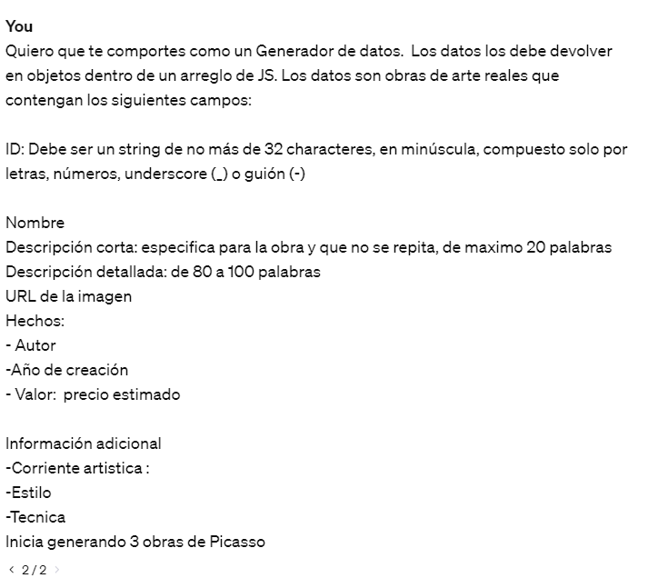
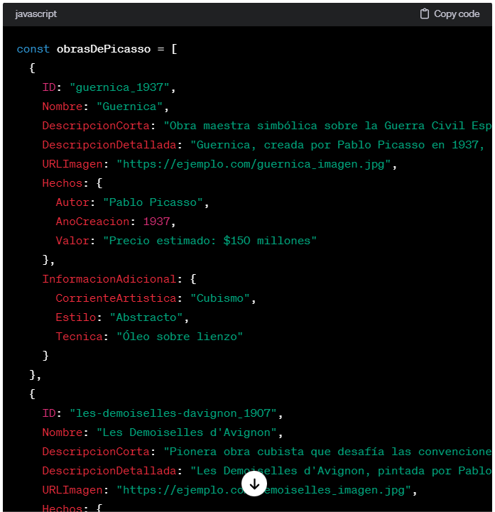
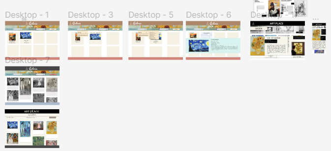
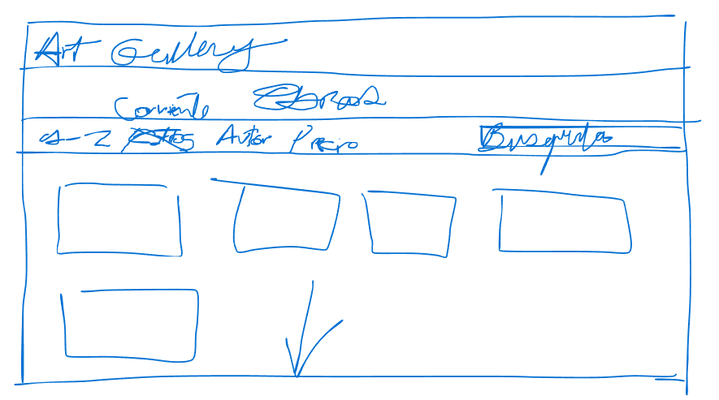
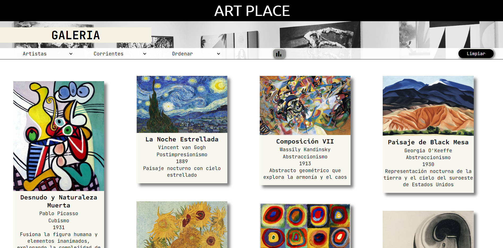
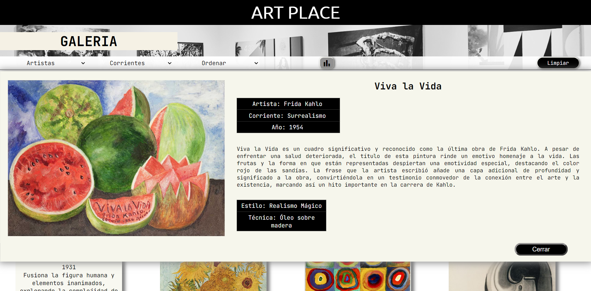

# Dataverse

## Índice

* [1. Preámbulo](#1-preámbulo)
* [2. Resumen del proyecto](#2-resumen-del-proyecto)
* [3. Consideraciones generales](#3-consideraciones-generales)
* [4. Funcionalidades](#4-funcionalidades)
* [5. Consideraciones técnicas](#5-consideraciones-técnicas)
* [6. Criterios de aceptación mínimos del proyecto](#6-criterios-de-aceptación-mínimos-del-proyecto)
* [7. Hacker edition](#7-hacker-edition)
* [8. Objetivos de aprendizaje](#8-objetivos-de-aprendizaje)
  [9. Diseño](#9-diseño)
* [10. Proyecto Final](#10-proyecto-final)
* [11. Pistas, tips y lecturas complementarias](#11-pistas-tips-y-lecturas-complementarias)
* [12. Consideraciones para pedir tu Project Feedback](#12-consideraciones-para-pedir-tu-project-feedback)

***

## 1. Preámbulo

Según [Forbes](https://www.forbes.com/sites/bernardmarr/2018/05/21/how-much-data-do-we-create-every-day-the-mind-blowing-stats-everyone-should-read),
el 90% de la data que existe hoy ha sido creada durante los últimos dos años.
Cada día generamos 2.5 millones de terabytes de datos, una cifra sin
precedentes.

No obstante, los datos por sí mismos son de poca utilidad. Para que esas
grandes cantidades de datos se conviertan en **información** fácil de leer para
las usuarias, necesitamos entender y procesar estos datos. Una manera simple de
hacerlo es creando _interfaces_ y _visualizaciones_.

En la siguiente imagen, podrás ver cómo con la data que que se ve en la parte
izquierda se puede construir una interfaz amigable y entendible por las
usuarias, al lado derecho.


## 2. Resumen del proyecto

En este proyecto **construirás una _página web_ para visualizar un
_conjunto (set) de datos_** que vas a generar con [prompting](https://www.itmadrid.com/que-es-un-prompt-en-inteligencia-artificial-ia/).
Esta página web se adecuará a lo que descubras que tu usuaria
necesita.

Además, en este proyecto utilizarás herramientas de
[inteligencia artificial](https://es.wikipedia.org/wiki/Inteligencia_artificial)
como [ChatGPT](https://openai.com/chatgpt), [ExplainDev](https://explain.dev/),
entre otras para generar un set de datos en un archivo javascript.

El propósito de generar los datos en esta manera es brindarte la oportunidad de
adentrarte en el empleo de herramientas impulsadas por la inteligencia
artificial, así como en [técnicas de
prompting](https://learnprompting.org/es/docs/intro).

Como entregable final tendrás una página web que permita **visualizar la data,
filtrarla, ordenarla y calcular alguna estadística**. Con estadística
nos referimos a distintos cálculos que puedes hacer con los datos para mostrar
información aún más relevante a las usuarias (promedio, el valor máximo
o mínimo, etc).

## 3. Consideraciones generales

* Este proyecto se debe resolver en duplas.
* El rango de tiempo estimado para completar el proyecto es de 4 a 5 Sprints.
* El tiempo estimado que deberías dedicar a la [generación de los datos](#generar-los-datos)
  es de máximo un sprint. Además, al final del proyecto deberás presentar
  un [screenshot del prompt utilizado](#prompt-utilizado).
* Si ves que te va a tomar más tiempo,
  deberás utilizar los datos de ejemplo que los vas a encontrar en
  esta ruta: `./src/data/dataset.js`.
* El proyecto será entregado subiendo tu código a GitHub (commit/push) y la
  interfaz será desplegada usando [GitHub Pages](https://pages.github.com/).

## 4. Funcionalidades

Como entregable final tendrás una página web que permita **visualizar la data,
filtrarla, ordenarla y calcular alguna estadística**.

Aquí definimos en más detalle las funcionalidades mínimas que debe tener:

* La aplicación debe permitir a la usuaria ver los items de la data en una visualización,
  que puede ser [tipo tarjetas](http://www.uxables.com/diseno-ux-ui/que-es-y-como-disenar-una-card/)
  o cualquier otra forma que tú decidas como la adecuada (pero desde aquí
  referimos a los items como "tarjetas"). **Cada una de las tarjetas debe estar
  contenida en un elemento `<li>` y estos a su vez contenido en
  un elemento `<ul>`.**

* El elemento `<ul>` deberá ser hijo de un elemento con atributo _id_
  de valor "root". **Este es un paso importante para que tu**
  **aplicación tenga la estructura requerida**

* Las tarjetas deben resaltar los valores de las propiedades de la data que
  le interesaría a la usuaria ver. Por ejemplo: nombre, fecha, imagen, etc.
  **Si vas a filtrar u ordenar por una propiedad, la tarjeta tiene que mostrar
  el valor de esta propiedad a la usuaria.**

* La interfaz debe estructurar semánticamente la data usando el estándar [microdatos](https://developer.mozilla.org/en-US/docs/Web/HTML/Microdata).
  Es obligatorio usar al menos los atributos [`itemscope`](https://developer.mozilla.org/en-US/docs/Web/HTML/Global_attributes/itemscope),
  [`itemtype`](https://developer.mozilla.org/en-US/docs/Web/HTML/Global_attributes/itemtype)
  y el atributo [`itemprop`](https://developer.mozilla.org/en-US/docs/Web/HTML/Global_attributes/itemprop).

  Por ejemplo, la siguiente data correspondiente a Ada Lovelace:

  ```json
    {
      "id": "ada-lovelace",
      "name": "Ada Lovelace",
      "shortDescription": "Pionera de la informática, fue la primera programadora.",
      "description": "Una visionaria del siglo XIX ...",
      "imageUrl": "URL_DE_LA_IMAGEN_GENERADA",
      "facts": {
        "yearOfBirth": 1843,
        "placeOfBirth": "London, England",
        "mainField": "Computer Science",
      }
    }
  ```

  puede ser estructurada semánticamente en HTML como:

  ```html
  <dl itemscope itemtype="WomenInTech">
    
    <dt>Nombre:</dt><dd itemprop="name">Ada Lovelace</dd>
    <dt>Descripción:</dt><dd itemprop="description">Pionera de la informática, fue la primera programadora.</dd>
    <dt>Año de nacimiento:</dt><dd itemprop="yearOfBirth">1843</dd>
    <dt>Lugar de nacimiento:</dt><dd itemprop="placeOfBirth">London, England</dd>
    <dt>Campo de desempeño:</dt><dd itemprop="mainField">Computer Science</dd>
  </dl>
  ```

* La aplicación debe calcular y visualizar una estadística de la data. Puede
  ser una propiedad computada de cada item, como una propiedad adicional
  (por ejemplo, el índice de masa corporal de cada pokemon) o unas estadísticas
  de la data completa (por ejemplo, total de personas nacidas en los años 80s).

* La aplicación debe permitir a la usuaria filtrar la data. Deberás usar
  un elemento [`<select>`](https://developer.mozilla.org/en-US/docs/Web/HTML/Element/select)
  con [un atributo de datos](https://developer.mozilla.org/es/docs/Learn/HTML/Howto/Use_data_attributes)
  `data-testid="select-filter"`, y un atributo `name` con el nombre
  de la propiedad por la que filtrará (por ejemplo, si vas a filtrar por "type",
  el `<select>` tendrá  `name="type"`). Los `<option>` de este `<select>` deberán
  tener en el atributo `value` el valor del filtro (por ejemplo, si vas a filtrar
  por type "fire" sería `<option value="fire">Fire</option>`).

* La aplicación debe permitir a la usuaria ordenar la data.
  - Tendrá al menos un control `<select>` para ordenar.
  - Si usas solo un control `<select>`, debe tener
    [un atributo de datos](https://developer.mozilla.org/es/docs/Learn/HTML/Howto/Use_data_attributes)
    `data-testid="select-sort"` y un atributo `name` con el nombre de la
    propiedad por la que ordenará. (por ejemplo, si vas a ordenar por
    "num" seria `name="num"`). Este `<select>` tendrá dos [`<option>`](https://developer.mozilla.org/en-US/docs/Web/HTML/Element/option)
    con `value` `asc` y `desc`, para ordenar ascendente y descendente la data
    respectivamente (por ejemplo, `<option value="asc">A - Z</option>`).
  - Una alternativa es ofrecer la usuaria un ordenamiento mas complejo.
    Podrías implementar ordenar por varios propiedades. En este caso sería con
    un `<select>` con un atributo de datos `data-testid="select-sort"`, y que
    contiene hijos `<option>` con un `value` del nombre de la propiedad con
    cual vas a ordenar. (Por ejemplo, `<option value="name">Nombre</option>`).
    También, necesitarás otro control (`<radio>`,`<select>`, etc.) para decir
    que el ordenamiento es ascendente o descendente. Este control secundaria
    tendrá un atributo `name="sort-order"`, y tiene values `asc` y `desc`.

* Las funcionalidades de ordenar deben operar sobre la data filtrada.
  Por ejemplo, si filtro los pokemones de tipo fuego y luego los ordeno por
  nombre ascendentemente, la aplicación deberá mantener el filtro aplicado y
  ordenar los pokemones de tipo fuego.

* La aplicación debe permitir a la usuaria reiniciar la aplicación, limpiando
  filtros y ordenamiento, con un `<button>` con un atributo de datos
  `data-testid="button-clear"`.

* Las operaciones de filtrar, ordenar, limpiar, etc. no deben recargar
  la página, si no que deben agregar el contenido en una manera
  dinámica via javascript.

* La aplicación será _responsive_, es decir, debe visualizarse sin problemas
  desde distintos tamaños de pantallas: móviles, tablets y desktops.

Los siguientes wireframes, son ejemplos de una interfaz que puede cumplir con esta
funcionalidad. Como podrás ver, estos diseños cumplen con la metodología
[Mobile First](https://developer.mozilla.org/es/docs/Glossary/Mobile_First), la misma
que te recomendamos utilizar en todos tus proyectos:

Diseño Mobile:

* [Wireframe mobile 1](https://github.com/Laboratoria/curriculum/assets/123121338/54711bb7-cb05-448e-b677-3cbd9bf13c14)
* [Wireframe mobile 2](https://github.com/Laboratoria/curriculum/assets/123121338/bf96d3ce-150f-47a2-a605-2efac2e0497b)

Diseño Desktop:

* [Wireframe desktop 1](https://github-production-user-asset-6210df.s3.amazonaws.com/92090/261137084-1625aeb8-883c-4b79-86da-5fab34fa5b88.png)
* [Wireframe desktop 2](https://github-production-user-asset-6210df.s3.amazonaws.com/92090/261137087-6cef16bc-643a-4d6d-bc1c-e0daaeb21c88.png)

## 5. Consideraciones técnicas

La lógica del proyecto debe estar implementada completamente en JavaScript
(ES6), HTML y CSS. En este proyecto NO está permitido usar librerías o
frameworks, solo [vanilla JavaScript](https://medium.com/laboratoria-how-to/vanillajs-vs-jquery-31e623bbd46e),
con la excepción de librerías para hacer gráficas (charts); ver
[_Parte opcional_](#7-hacker-edition) más arriba.

El _boilerplate_ contiene una estructura de archivos como punto de partida así
como toda la configuración de dependencias:

```text
.
├── README.md
├── package.json
├── src
|  ├── data 
|  |  └── dataset.js (La que hayas generado con la IA)
|  ├── dataFunctions.js
|  ├── view.js
|  ├── index.html
|  ├── main.js
|  └── style.css
└── test
   └── data.js
   └── dataFunctions.spec.js
   └── tests-read-only

```

### `src/index.html`

Como en el proyecto anterior, existe un archivo `index.html`. Como ya sabes,
acá va la página que se mostrará a la usuaria. También nos sirve para indicar
qué scripts se usarán y unir todo lo que hemos hecho.

### `src/main.js`

Recomendamos usar `src/main.js` para todo tu código que tenga que ver con
mostrar los datos en la pantalla. Con esto nos referimos básicamente a la
interacción con el DOM. Operaciones como creación de nodos, registro de
manejadores de eventos (_event listeners_ o _event handlers_).

Esta no es la única forma de dividir tu código, puedes usar más archivos y
carpetas, siempre y cuando la estructura sea clara para tus compañeras.

En este archivo encontrarás una serie de _imports_ listos para _cargar_
las diferentes fuentes de datos.

Por ejemplo, lost datos con los que vas a trabajar,
los encontrarás en la siguiente línea:

```js
import data from './data/dataset.js';
```

### `src/dataFunctions.js`

El corazón de este proyecto es la manipulación de datos a través de arreglos
y objetos.

Este archivo va a contener toda la funcionalidad que corresponda
a obtener, procesar y manipular datos (tus funciones). Por ejemplo:

* `filterData(data, filterBy, value)`: esta función recibe tres parámetros.
  El primer parámetro, `data`, nos entrega los datos.
  El segundo parámetro, `filterBy`, nos dice con respecto a cuál de los campos de
  la data se quiere filtrar.
  El tercer parámetro, `value`, indica el valor de campo que queremos filtrar.

* `sortData(data, sortBy, sortOrder)`: esta función `sort` u ordenar
  recibe tres parámetros.
  El primer parámetro, `data`, nos entrega los datos.
  El segundo parámetro, `sortBy`, nos dice con respecto a cuál de los campos de
  la data se quiere ordenar.
  El tercer parámetro, `sortOrder`, indica si se quiere ordenar de manera
  ascendente o descendente.

* `computeStats(data)`: la función `compute` o calcular, nos permitirá hacer
  cálculos estadísticos básicos para ser mostrados de acuerdo a la data
  proporcionada, esta función debe usar el método reduce.

Estas funciones deben ser [_puras_](https://medium.com/laboratoria-developers/introducci%C3%B3n-a-la-programaci%C3%B3n-funcional-en-javascript-parte-2-funciones-puras-b99e08c2895d)
e independientes del DOM. Estas funciones serán después usadas desde el archivo
`src/main.js`, al cargar la página, y cada vez que la usuaria interactúe
(click, filtrado, ordenado, ...).

### `src/data`

En esta carpeta están los datos con los que vas a trabajar (los datos de ejemplo
o los datos que generarías con ayuda de la inteligencia artificial).

### `test/dataFunctions.spec.js`

En este archivo tendrás hacer pruebas unitarias de las funciones
implementadas en el archivo `dataFunctions.js`. (`filterBy`, `sortBy`, etc.)

### `test/data.js`

En esta archivo puedes construir y exportar data "mock" para usar en los tests.
Es mas fácil probar un arreglo de 5 elementos de un arreglo de 24, por eso
vas a crear una muestra de la data que quieres probar. Como mínimo
debes exportar un variable se llama `data`, pero puedes definir y exportar mas
si sea necesario para tus tests.

### `src/view.js`

Para alcanzar mejor separación de responsabilidades en el código este
archivo debe tener todas las funciones que utilizara para renderizar
los elementos dinámicamente.

Al menos se requeriere una función obligatoria:

* `renderItems(data)`: esta función recibe el arreglo de data para renderizar
  los elementos de cada item, y debería volver un elemento DOM o
  un string de HTML.

## 6. Criterios de aceptación mínimos del proyecto

### Criterios de código

Con cada objetivo de aprendizaje, evaluamos que el código cumpla con algunos
criterios. Lo cual no excluye que puedas usar otras opciones, por ejemplo
en el caso de los selectores, proponemos el uso de `querySelector`,
no significa que no puedes usar `querySelectorAll` o `getElementId` también.

Puedes ejecutar las pruebas de cada grupo de objetivos de aprendizaje de manera
individual con los siguientes comandos:

``` sh
npm run test:oas-html
npm run test:oas-css
npm run test:oas-web-api
npm run test:oas-js
npm run test:oas-prompting
npm run test:oas // Esto es para correr todos los tests de OAs
```

#### HTML

* **Uso de HTML semántico**

  - [x] Tiene un `<header>` con `<h1>`
  - [x] Tiene un `<footer>`
  - [x] Tiene un `<main>` con `<h2>`
  - [] Todas las etiquetas de controles (inputs, selects, radio, etc) tienen `<label>`
  - [] `<ul>` esta usado para dibujar la data
  - [x] Los hijos de `<li>` usan attributos de microdata `itemscope` e `itemprop`

#### CSS

* **Uso de selectores de CSS**

  - [x] Uso de selector class para los items <li>
  - [x] Uso de flexbox en sentido `row` y `column`
  - [x] Uso de flexbox para el elemento que contiene los items
  - [x] Uso de flexbox para el elemento que contiene los UI inputs

#### Web APIs

* **Uso de selectores del DOM**

  - [x] La aplicación usa [`querySelector`](https://developer.mozilla.org/en-US/docs/Web/API/Document/querySelector)
    para buscar los elementos del DOM
  
* **Manejo de eventos del DOM (listeners, propagación, delegación)**

  - [x] `addEventListener` con callback que tiene parámetro de `event`,
    lo que permite el uso del objeto [`event`](https://developer.mozilla.org/en-US/docs/Learn/JavaScript/Building_blocks/Events#event_objects)
    con `event.target` o `event.currentTarget`
  - [x] La aplicación registra [Event Listeners](https://developer.mozilla.org/en/docs/Web/API/EventTarget/addEventListener)
    para escuchar `click`, `change`, `keyup` dependiendo del evento que
    se quiere escuchar

* **Manipulación dinámica del DOM**

  - [x] La aplicación actualiza el atributo [`innerHTML`](https://developer.mozilla.org/es/docs/Web/API/Element/innerHTML).
  - [x] La aplicación usa `createElement` y `appendChild`, o template strings
    para crear elementos

#### JavaScript

* **Variables (declaración, asignación, ámbito)**

  - [x] La aplicación declara variables con [`let`](https://developer.mozilla.org/en-US/docs/Web/JavaScript/Reference/Statements/let)
    y [`const`](https://developer.mozilla.org/en-US/docs/Web/JavaScript/Reference/Statements/const)
    en manera adecuada

* **Uso de condicionales (if-else, switch, operador ternario, lógica booleana)**

  - [x] La aplicación usa el statement
    [`if..else`](https://developer.mozilla.org/en-US/docs/Web/JavaScript/Reference/Statements/if...else)
      para evaluar condiciones

* **Uso de bucles/ciclos (while, for, for..of)**

  - [x] La aplicación usa el statement [`for`](https://developer.mozilla.org/en-US/docs/Web/JavaScript/Reference/Statements/for)
    o método [`forEach`](https://developer.mozilla.org/en-US/docs/Web/JavaScript/Reference/Global_Objects/Array/forEach)
    para iterar

* **Funciones (params, args, return)**

  En el archivo `dataFunctions.js` define las siguientes funciones:
  - [x] una función `sortBy` que tiene 3 parámetros (`data`, `sortBy`, `sortOrder`)
    y devuelve el arreglo ordenado
  - [x] una función `filterBy` que tiene 3 parámetros (`data`, `filterBy`, `value`)
    y devuelve el arreglo filtrado
  - [x] una función `computeStats` que tiene al menos un parámetro (`data`)
    y devuelve un valor computado

  Más sobre estos puntos en [la sección dataFunctions.js](#src/dataFunctions.js)

* **Arrays (arreglos)**

  - [x] Uso de [Arreglos](https://curriculum.laboratoria.la/es/topics/javascript/04-arrays)
  - [x] Uso de [Array.prototype.sort() - MDN](https://developer.mozilla.org/es/docs/Web/JavaScript/Reference/Global_Objects/Array/sort)
    o [Array.prototype.toSorted - MDN](https://developer.mozilla.org/es/docs/Web/JavaScript/Reference/Global_Objects/Array/toSorted)
  - [x] Uso de [Array.prototype.forEach() - MDN](https://developer.mozilla.org/es/docs/Web/JavaScript/Reference/Global_Objects/Array/forEach)
  - [x] Uso de [Array.prototype.map() - MDN](https://developer.mozilla.org/es/docs/Web/JavaScript/Reference/Global_Objects/Array/map)
  - [x] Uso de [Array.prototype.filter() - MDN](https://developer.mozilla.org/es/docs/Web/JavaScript/Reference/Global_Objects/Array/filter)
  - [x] Uso de [Array.prototype.reduce() - MDN](https://developer.mozilla.org/es/docs/Web/JavaScript/Reference/Global_Objects/Array/Reduce)

* **Objetos**

  - [x] Uso de notación de punto para [acceder propiedades](https://developer.mozilla.org/en-US/docs/Web/JavaScript/Reference/Operators/Property_accessors)
  - [x] Uso de notación de brackets para [acceder propiedades](https://developer.mozilla.org/en-US/docs/Web/JavaScript/Reference/Operators/Property_accessors)

* **Módulos de ECMAScript (ES Modules)**

  - [x] La aplicación usa [`import`](https://developer.mozilla.org/en-US/docs/Web/JavaScript/Reference/Statements/import)
    y [`export`](https://developer.mozilla.org/en-US/docs/Web/JavaScript/Reference/Statements/export)
    para importar y exportar valores desde un modulo JavaScript.

### Criterios del proyecto

#### Definición del producto
##### Tema

Galería de Obras de arte
##### Necesidades de los usuarios

Los usuarios quieren una página donde puedan consultar obras de arte cómodamente y rápido mediante filtros, por ejemplo buscar por orden alfabético, por corriente artística  y por artistas.

#### Historias de usuario

Se crearon las historias de usuario para ir trabajando por sprint. Ejemplo de la primer historia de usuario:
Historia de Usuario
**Como** (descripcion del usuario) persona interesada en el arte
**Quiero** (Funcionalidad)__ poder ver obras de arte a modo de tarjetas
**Para** (beneficio): __Explorarlas fácilmente
**Criterios de aceptación**
• Las tarjetas deben mostrar una imagen de la obra de arte, el título de la obra, el nombre del artista
• Las tarjetas deben ser de tamaño uniforme y estar dispuestas en una cuadrícula.
Aceptación: Definition of done
• Se considerará terminada cuando las tarjetas muestren la información requerida.

#### Generar los datos
La temática elegida es Obras de Arte


La temática será a tu gusto, por ejemplo, pueden ser personajes importantes
en la historia, personajes inventados, países, películas... etc.

Los datos se guardaron en un archivo javascript. Este archivo exporta
un arreglo con 24 objetos. Y la estructura de cada objeto
debe es la siguiente:

* `id`: Identificador único (no pueden haber dos elementos con el mismo `id`).
  Debe ser un string de no más de 32 characteres, en minúscula, compuesto solo
  por letras, números, underscore (`_`) o guión (`-`). Por ejemplo: `"noche-estrellada"`.
* `name`: El nombre de la obra.
* `shortDescription`: Descripción corta de la obra, de max 20 palabras. 
* `description`: Descripción detallada de la obra. Esta descripción deberá
  tener entre 80 y 100 palabras. 
* `imageUrl`: URL de la imagen. 
* `facts`: Fecha,  nombre del artista y movimiento artístico.
  
* `extraInfo`: Técnica y Estilo.
  

Los datos están en el archivo:
`./src/data/artdata.js`.


#### Prompt utilizado

Se utilizó un prompt para generar los datos:

Para efectos de la base de datos se fueron generando las obras por nombre de artista. De manera que se obtiene un total de 24 obras.


#### Diseño de la Interfaz de Usuaria
Bocetos iniciales de la interfaz de usuaria:


##### Prototipo de alta fidelidad

El prototipo fue creado en Figma, tanto para desktop como para teléfonos móviles.
https://www.figma.com/file/ZNw3k3LMWIG5G5F0D1e31R/Data-verse?type=design&node-id=0%3A1&mode=design&t=HlgrMWwKvhWJxVXC-1

#### Testeos de usabilidad

A través del desarrollo del proyecto, encontramos que el diseño inicial no era agradable a la vista por la combinación de las imágenes de las obras de arte y la mezcla de color. Se cambió el diseño a colores neutros y sobrios. 

#### Implementación de la Interfaz de Usuaria (HTML/CSS/JS)

Se realizó la página, con las funcionalidades establecidas en el diseño.

#### Pruebas unitarias

Se crearon las pruebas para las funciones de filtrar, ordenar y la función estadística.


## 7. Hacker edition

* 100% Coverage

## 8. Objetivos de aprendizaje


Reflexiona y luego marca los objetivos que has llegado a entender y aplicar en tu proyecto. Piensa en eso al decidir tu estrategia de trabajo.

### HTML

- [x] **Uso de HTML semántico**

  <details><summary>Links</summary><p>

  * [HTML semántico](https://curriculum.laboratoria.la/es/topics/html/html5/semantic-html)
  * [Semantics - MDN Web Docs Glossary](https://developer.mozilla.org/en-US/docs/Glossary/Semantics#Semantics_in_HTML)
</p></details>

### CSS

- [x] **Uso de selectores de CSS**

  <details><summary>Links</summary><p>

  * [Intro a CSS](https://curriculum.laboratoria.la/es/topics/css/css/intro-css)
  * [CSS Selectors - MDN](https://developer.mozilla.org/es/docs/Web/CSS/CSS_Selectors)
</p></details>

- [x] **Modelo de caja (box model): borde, margen, padding**

  <details><summary>Links</summary><p>

  * [Box Model & Display](https://curriculum.laboratoria.la/es/topics/css/css/boxmodel-and-display)
  * [The box model - MDN](https://developer.mozilla.org/en-US/docs/Learn/CSS/Building_blocks/The_box_model)
  * [Introduction to the CSS box model - MDN](https://developer.mozilla.org/en-US/docs/Web/CSS/CSS_Box_Model/Introduction_to_the_CSS_box_model)
  * [CSS display - MDN](https://developer.mozilla.org/pt-BR/docs/Web/CSS/display)
  * [display - CSS Tricks](https://css-tricks.com/almanac/properties/d/display/)
</p></details>

- [X] **Uso de flexbox en CSS**

  <details><summary>Links</summary><p>

  * [A Complete Guide to Flexbox - CSS Tricks](https://css-tricks.com/snippets/css/a-guide-to-flexbox/)
  * [Flexbox Froggy](https://flexboxfroggy.com/#es)
  * [Flexbox - MDN](https://developer.mozilla.org/en-US/docs/Learn/CSS/CSS_layout/Flexbox)
</p></details>

### Web APIs

- [x] **Uso de selectores del DOM**

  <details><summary>Links</summary><p>

  * [Manipulación del DOM](https://curriculum.laboratoria.la/es/topics/browser/dom/1-dom-methods-selection)
  * [Introducción al DOM - MDN](https://developer.mozilla.org/es/docs/Web/API/Document_Object_Model/Introduction)
  * [Localizando elementos DOM usando selectores - MDN](https://developer.mozilla.org/es/docs/Web/API/Document_object_model/Locating_DOM_elements_using_selectors)
</p></details>

- [x] **Manejo de eventos del DOM (listeners, propagación, delegación)**

  <details><summary>Links</summary><p>

  * [Introducción a eventos - MDN](https://developer.mozilla.org/es/docs/Learn/JavaScript/Building_blocks/Events)
  * [EventTarget.addEventListener() - MDN](https://developer.mozilla.org/es/docs/Web/API/EventTarget/addEventListener)
  * [EventTarget.removeEventListener() - MDN](https://developer.mozilla.org/es/docs/Web/API/EventTarget/removeEventListener)
  * [El objeto Event](https://developer.mozilla.org/es/docs/Web/API/Event)
</p></details>

- [x] **Manipulación dinámica del DOM**

  <details><summary>Links</summary><p>

  * [Introducción al DOM](https://developer.mozilla.org/es/docs/Web/API/Document_Object_Model/Introduction)
  * [Node.appendChild() - MDN](https://developer.mozilla.org/es/docs/Web/API/Node/appendChild)
  * [Document.createElement() - MDN](https://developer.mozilla.org/es/docs/Web/API/Document/createElement)
  * [Document.createTextNode()](https://developer.mozilla.org/es/docs/Web/API/Document/createTextNode)
  * [Element.innerHTML - MDN](https://developer.mozilla.org/es/docs/Web/API/Element/innerHTML)
  * [Node.textContent - MDN](https://developer.mozilla.org/es/docs/Web/API/Node/textContent)
</p></details>

### JavaScript

- [x] **Diferenciar entre tipos de datos primitivos y no primitivos**

- [x] **Arrays (arreglos)**

  <details><summary>Links</summary><p>

  * [Arreglos](https://curriculum.laboratoria.la/es/topics/javascript/arrays)
  * [Array - MDN](https://developer.mozilla.org/es/docs/Web/JavaScript/Reference/Global_Objects/Array/)
  * [Array.prototype.sort() - MDN](https://developer.mozilla.org/es/docs/Web/JavaScript/Reference/Global_Objects/Array/sort)
  * [Array.prototype.forEach() - MDN](https://developer.mozilla.org/es/docs/Web/JavaScript/Reference/Global_Objects/Array/forEach)
  * [Array.prototype.map() - MDN](https://developer.mozilla.org/es/docs/Web/JavaScript/Reference/Global_Objects/Array/map)
  * [Array.prototype.filter() - MDN](https://developer.mozilla.org/es/docs/Web/JavaScript/Reference/Global_Objects/Array/filter)
  * [Array.prototype.reduce() - MDN](https://developer.mozilla.org/es/docs/Web/JavaScript/Reference/Global_Objects/Array/Reduce)
</p></details>

- [x] **Objetos (key, value)**

  <details><summary>Links</summary><p>

  * [Objetos en JavaScript](https://curriculum.laboratoria.la/es/topics/javascript/objects/objects)
</p></details>

- [x] **Variables (declaración, asignación, ámbito)**

  <details><summary>Links</summary><p>

  * [Valores, tipos de datos y operadores](https://curriculum.laboratoria.la/es/topics/javascript/basics/values-variables-and-types)
  * [Variables](https://curriculum.laboratoria.la/es/topics/javascript/basics/variables)
</p></details>

- [x] **Uso de condicionales (if-else, switch, operador ternario, lógica booleana)**

  <details><summary>Links</summary><p>

  * [Estructuras condicionales y repetitivas](https://curriculum.laboratoria.la/es/topics/javascript/flow-control/conditionals-and-loops)
  * [Tomando decisiones en tu código — condicionales - MDN](https://developer.mozilla.org/es/docs/Learn/JavaScript/Building_blocks/conditionals)
</p></details>

- [x] **Uso de bucles/ciclos (while, for, for..of)**

  <details><summary>Links</summary><p>

  * [Bucles (Loops)](https://curriculum.laboratoria.la/es/topics/javascript/flow-control/loops)
  * [Bucles e iteración - MDN](https://developer.mozilla.org/es/docs/Web/JavaScript/Guide/Loops_and_iteration)
</p></details>

- [x] **Funciones (params, args, return)**

  <details><summary>Links</summary><p>

  * [Funciones (control de flujo)](https://curriculum.laboratoria.la/es/topics/javascript/flow-control/functions)
  * [Funciones clásicas](https://curriculum.laboratoria.la/es/topics/javascript/functions/classic)
  * [Arrow Functions](https://curriculum.laboratoria.la/es/topics/javascript/functions/arrow)
  * [Funciones — bloques de código reutilizables - MDN](https://developer.mozilla.org/es/docs/Learn/JavaScript/Building_blocks/Functions)
</p></details>

- [x] **Pruebas unitarias (unit tests)**

  <details><summary>Links</summary><p>

  * [Empezando con Jest - Documentación oficial](https://jestjs.io/docs/es-ES/getting-started)
</p></details>

- [x] **Módulos de ECMAScript (ES Modules)**

  <details><summary>Links</summary><p>

  * [import - MDN](https://developer.mozilla.org/es/docs/Web/JavaScript/Reference/Statements/import)
  * [export - MDN](https://developer.mozilla.org/es/docs/Web/JavaScript/Reference/Statements/export)
</p></details>

- [x] **Uso de linter (ESLINT)**

- [x] **Uso de identificadores descriptivos (Nomenclatura y Semántica)**

- [x] **Diferenciar entre expresiones (expressions) y sentencias (statements)**

### Control de Versiones (Git y GitHub)

- [x] **Git: Instalación y configuración**

- [x] **Git: Control de versiones con git (init, clone, add, commit, status, push, pull, remote)**

- [x] **Git: Integración de cambios entre ramas (branch, checkout, fetch, merge, reset, rebase, tag)**

- [x] **GitHub: Creación de cuenta y repos, configuración de llaves SSH**

- [ ] **GitHub: Despliegue con GitHub Pages**

  <details><summary>Links</summary><p>

  * [Sitio oficial de GitHub Pages](https://pages.github.com/)
</p></details>

- [x] **GitHub: Colaboración en Github (branches | forks | pull requests | code review | tags)**

### Centrado en el usuario

- [x] **Diseñar y desarrollar un producto o servicio poniendo a las usuarias en el centro**

### Diseño de producto

- [x] **Crear prototipos de alta fidelidad que incluyan interacciones**

- [x] **Seguir los principios básicos de diseño visual**

### Investigación

- [x] **Planear y ejecutar testeos de usabilidad de prototipos en distintos niveles de fidelidad**

  <details><summary>Links</summary><p>

  * [Intro a testeos usabilidad](https://coda.io/@bootcamp-laboratoria/contenido-ux/test-de-usabilidad-15)
  * [Pruebas con Usuarios 1 — ¿Qué, cuándo y para qué testeamos?](https://eugeniacasabona.medium.com/pruebas-con-usuarios-1-qu%C3%A9-cu%C3%A1ndo-y-para-qu%C3%A9-testeamos-7c3a89b4b5e7)
</p></details>

### AI Prompting

- [x] **Dando Instrucciones**

  <details><summary>Links</summary><p>

  * [Dando Instrucciones | Learn Prompting: Your Guide to Communicating with AI](https://learnprompting.org/es/docs/basics/instructions)
</p></details>

- [x] **Few shot prompting**

  <details><summary>Links</summary><p>

  * [Few shot prompting | Learn Prompting: Your Guide to Communicating with AI](https://learnprompting.org/es/docs/basics/few_shot)
</p></details>

## 9. Diseño
Aunque experimentamos cambios a lo largo del proceso, desde el inicio teníamos una idea clara de la distribución de nuestra página web. A pesar de los ajustes, logramos mantener elementos clave de nuestro diseño inicial, lo que contribuyó a preservar la estructura y la esencia de nuestro proyecto.


Enfrentamos ciertas complicaciones al seleccionar una paleta de colores, dado que nuestras obras presentaban una amplia variedad cromática. Fue un desafío encontrar un color que se adaptara armoniosamente a todas las piezas. Como solución, optamos por una paleta de colores neutros, proporcionando una base equilibrada que complementa cada obra sin restarle protagonismo a sus colores individuales.


## 10. Proyecto Final

Iniciamos nuestro proyecto con una investigación y la creación de prototipos,a medida que materializábamos nuestras ideas en la interfaz, enfrentamos múltiples desafíos y experimentamos cambios constantes. Realizamos ajustes significativos hasta lograr fusionar nuestras decisiones . El proyecto final que presentamos es el fruto de nuestro esfuerzo, creatividad y perseverancia en cada etapa del desarrollo.


Nuestra interfaz ofrece una visión detallada de las obras de arte presentadas, brindándote la oportunidad de explorar cada pieza en profundidad y apreciar sus detalles únicos.


**RESPONSIVE**
Este proyecto web tiene un diseño responsivo que brinda una experiencia de usuario fluida en dispositivos móviles y computadoras, en la cual aun podemos ver mas detalles de las obras de arte, sinembargo el diseño cambia para que la información mostrada se pueda ver con facilidad. 


## 11. Pistas, tips y lecturas complementarias

### Primeros pasos

Súmate al canal de Slack
[#project-dataverse](https://claseslaboratoria.slack.com/archives/C03MV35EP5M)
para conversar y pedir ayuda del proyecto.

Antes de empezar a escribir código, debes definir qué deberá hacer el
producto con base en el conocimiento que puedas obtener de tu usuaria.
Estas preguntas te pueden ayudar:

* ¿Quiénes son las principales usuarias del producto?
* ¿Cuáles son los objetivos de estas usuarias en relación con el producto?
* ¿Cuáles son los datos más relevantes que quieren ver en la interfaz y por qué?
* ¿Cuándo utilizan o utilizarían el producto?
* Toda tu investigación previa debe tener como resultado todas las Historias
  de Usuaria de tu proyecto.
* No hagas los prototipos de alta fidelidad de todas tus Historias. Comienza
  solamente por los que se necesiten para tu Sprint 1 (semana 1 de trabajo). Más
  pistas en la guía de organización para el proyecto.

Cuando ya estés lista para codear, te sugerimos empezar de esta manera:

1. Una de las integrantes del equipo debe realizar un :fork_and_knife:
   [fork](https://help.github.com/articles/fork-a-repo/) del repo de tu cohort,
   tus _coaches_ te compartirán un _link_ a un repo y te darán acceso de lectura
   en ese repo. La otra integrante del equipo deber hacer un fork **del
   repositorio de su compañera** y
   [configurar](https://gist.github.com/BCasal/026e4c7f5c71418485c1) un `remote`
   hacia el mismo.
2. :arrow_down: [Clona](https://help.github.com/articles/cloning-a-repository/)
   tu _fork_ a tu computadora (copia local).
3. 📦 Instala las dependencias del proyecto con el comando `npm install`. Esto
   asume que has instalado [Node.js](https://nodejs.org/) (que incluye [npm](https://docs.npmjs.com/)).
4. Si todo ha ido bien, deberías poder ejecutar las :traffic_light:
   pruebas unitarias (unit tests) con el comando `npm test`.
5. Para ver la interfaz de tu programa en el navegador, usa el comando
  `npm start` para arrancar el servidor web y dirígete a
  `http://localhost:5000` en tu navegador.
6. A codear se ha dicho! :rocket:

### Contenido de referencia

#### Desarrollo Front-end

* [Tópicos en la currícula de Laboratoria](https://curriculum.laboratoria.la/es/web-dev/topics)
  testing, arreglos, objetos, funciones, DOM en Browser Javascript.
* [Buscando elementos con querySelector*](https://es.javascript.info/searching-elements-dom)
* [Objeto del evento](https://es.javascript.info/introduction-browser-events#objeto-del-evento)
* [Array en MDN](https://developer.mozilla.org/es/docs/Web/JavaScript/Referencia/Objetos_globales/Array)
* [Array.sort en MDN](https://developer.mozilla.org/es/docs/Web/JavaScript/Referencia/Objetos_globales/Array/sort)
* [Array.toSorted en MDN](https://developer.mozilla.org/en-US/docs/Web/JavaScript/Reference/Global_Objects/Array/toSorted)
* [Array.map en MDN](https://developer.mozilla.org/es/docs/Web/JavaScript/Referencia/Objetos_globales/Array/map)
* [Array.filter en MDN](https://developer.mozilla.org/es/docs/Web/JavaScript/Referencia/Objetos_globales/Array/filter)
* [Array.reduce en MDN](https://developer.mozilla.org/es/docs/Web/JavaScript/Referencia/Objetos_globales/Array/reduce)
* [Array.forEach en MDN](https://developer.mozilla.org/es/docs/Web/JavaScript/Referencia/Objetos_globales/Array/forEach)
* [Object.keys en MDN](https://developer.mozilla.org/es/docs/Web/JavaScript/Referencia/Objetos_globales/Object/keys)
* [Object.entries en MDN](https://developer.mozilla.org/es/docs/Web/JavaScript/Referencia/Objetos_globales/Object/entries)
* [Atributos de datos](https://developer.mozilla.org/es/docs/Learn/HTML/Howto/Use_data_attributes)
* [expressions-vs-statements](https://2ality.com/2012/09/expressions-vs-statements.html)
* [expresión vs sentencia](https://openclassrooms.com/en/courses/4309531-descubre-las-funciones-en-javascript/5108986-diferencia-entre-expresion-y-sentencia)
* [Datos atómicos vs datos estructurados](https://www.todojs.com/tipos-datos-javascript-es6/)
* [Módulos: Export](https://developer.mozilla.org/es/docs/Web/JavaScript/Referencia/Sentencias/export)
* [Módulos: Import](https://developer.mozilla.org/es/docs/Web/JavaScript/Referencia/Sentencias/import)
* [Diferencia entre array y objetos](https://youtu.be/mJJloQY7A8Y)
* [¿Cómo puedo recorrer un objeto?](https://youtube.com/01RHn23Bn_0)
* [`map`, `filter`, `sort` y `reduce` también son métodos para objetos](https://youtu.be/bUl1R2lQvKo)
* [Diferencia entre expression y statements](https://youtu.be/wlukoWco2zk)
* [Diferencia entre createElement e innerHTML](https://www.javascripttutorial.net/javascript-dom/javascript-innerhtml-vs-createelement/)
* [¿Qué es el Scope?](https://youtu.be/s-7C09ymzK8)

#### Herramientas

* [Git](https://git-scm.com/)
* [GitHub](https://github.com/)
* [GitHub Pages](https://pages.github.com/)
* [Para preguntas sobre Git recomendamos ver este playlist](https://www.youtube.com/watch?v=F1EoBbvhaqU&list=PLiAEe0-R7u8k9o3PbT3_QdyoBW_RX8rnV)
* [Node.js](https://nodejs.org/)
* [Jest](https://jestjs.io/)

#### Organización del Trabajo

* [Historias de Usuario](https://www.youtube.com/watch?v=ky6wFiF5vMk&t=344s).
  Ojo que Cris no diferencia _Definición de terminado_ de _Criterios de
  Aceptación_ y nosotros sí lo haremos. Más detalles en la guía.
* [Cómo dividir H.U.](https://www.youtube.com/watch?v=Ueq786iZ30I&t=341s)

## 12. Consideraciones para pedir tu Project Feedback

Antes de agendar tu Project Feedback con un coach, asegúrate que tu proyecto:

* [ ] Cumple con todos los criterios mínimos de aceptación al ejecutar `npm run test:oas`
* [ ] Cumple con todas las pruebas _end to end_ al ejecutar `npm run test:e2e`
* [ ] Cumple con todas las pruebas unitarias al ejecutar `npm run test` y
  que tienen una cobertura del 70% de _statements_ (_sentencias_),
  _functions_ (_funciones_), _lines_ (_líneas_), y _branches_
* [ ] Esta libre de _errores_ de `eslint` al ejecutar `npm run pretest`
* [ ] Está subido a GitHub y desplegado en GitHub Pages
* [ ] Captura de pantalla del prompt utilizado para generar los datos.
* Tiene un `README.md` con la siguente:
  - [ ] _Definición del producto_ clara e informativa
  - [ ] Historias de usuario
  - [ ] Un _Diseño de la Interfaz de Usuaria_ (prototipo de alta fidelidad)
  - [ ] El listado de problemas que detectaste a través de tests
    de usabilidad en el `README.md`
* Tiene un UI que cumple las funcionalidades:
  - [ ] Muestra lista con datos y/o indicadores
  - [ ] Permite ordenar data por uno o más campos (asc y desc)
  - [ ] Permite filtrar data con base en una condición
  - [ ] Permite limpiar los filtros con un botón
  - [ ] Es _responsive_

Recuerda que debes hacer una autoevaluación de _objetivos de aprendizaje_ y
_life skills_ desde tu dashboard de estudiante.

Si no has completado todo lo anterior, no consideramos que estás lista para
tu sesión de Project Feedback.


